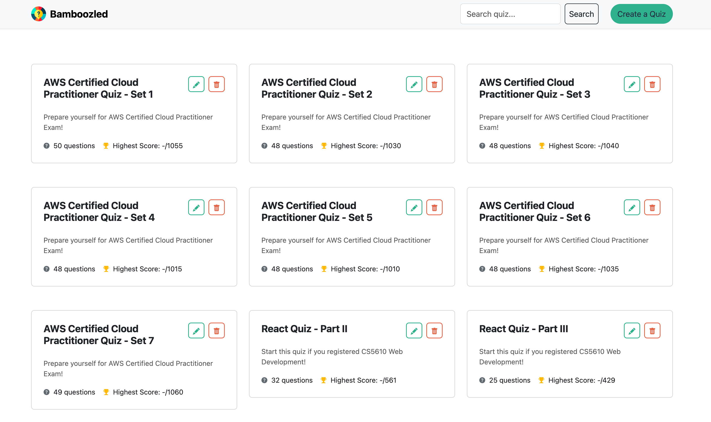
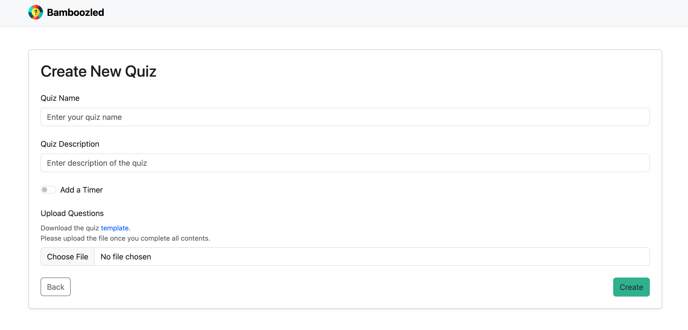
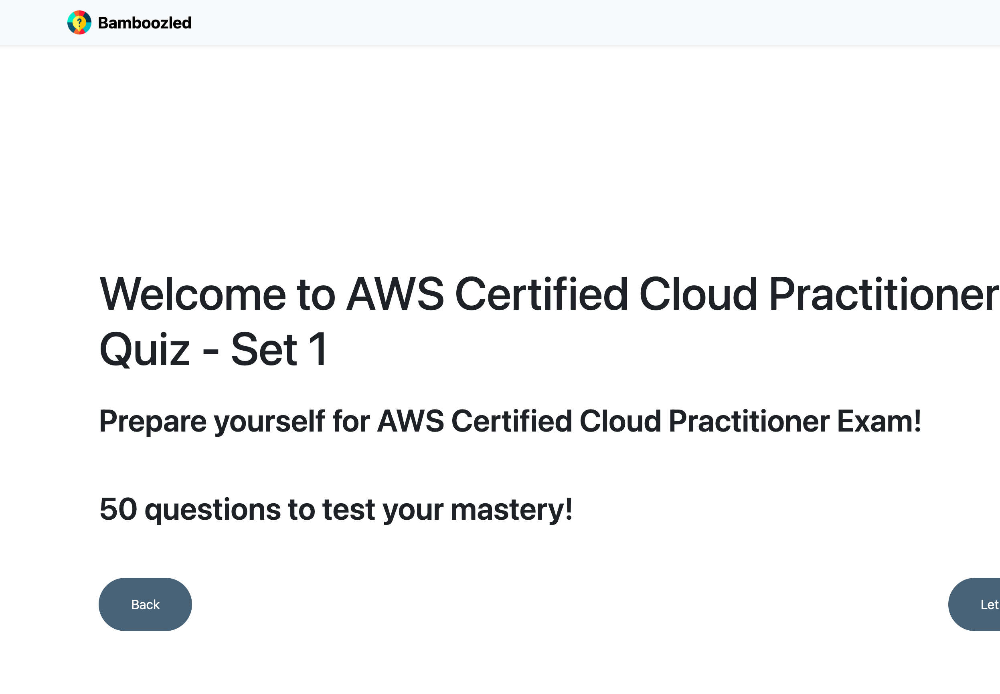
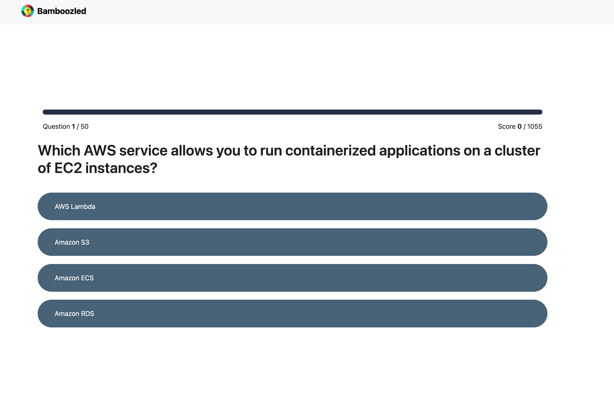
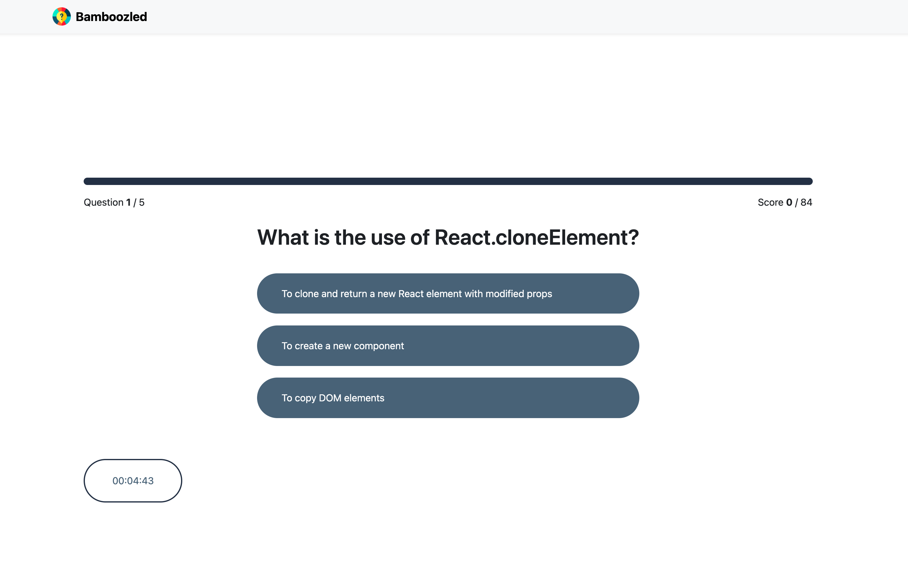
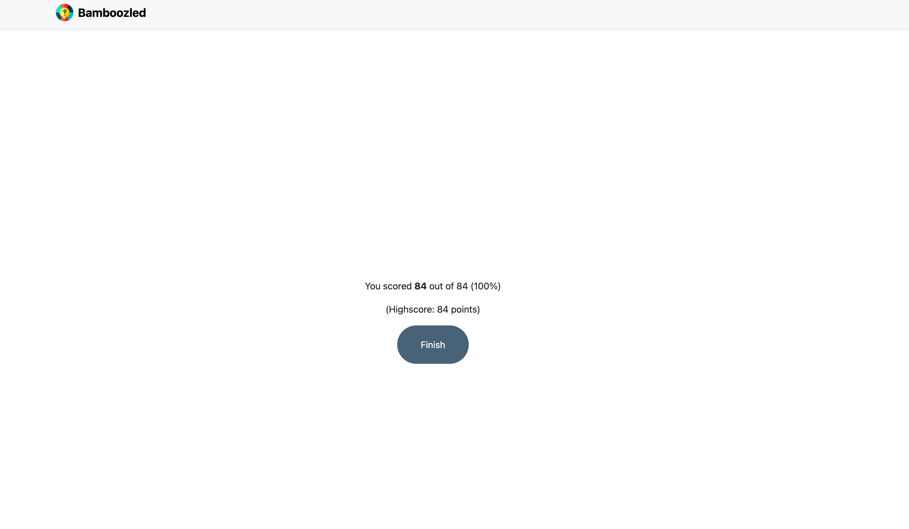

# Bamboozled (CS5610_Project3)

## Author

Qian (Summer) Li
[Github](https://github.com/summereth)

## Class Link

CS5610 Web Development [Course Page](https://johnguerra.co/classes/webDevelopment_spring_2025/)

Instructor: John Alexis Guerra Gómez [Profile](https://johnguerra.co/)

Provided by Northeastern University, Khoury College of Computer Sciences

## Project Objective

In this project we will apply concepts learned by building a full-stack application with both backend (Node + Express + Mongo) and frontend (React).

## Screenshots

### Homepage

### Create page

### Quiz page

#### Quiz ready

#### Quiz active

- Without timer
  

- With timer
  

#### Quiz finished

## Instructions to build

### Option 1: Live demo

[Website link](https://bamboozled-theta.vercel.app/)

Project deployed with Vercel. Database deployed with MongoDB Atlas.

### Option 2: Run locally

#### Step 1: Git clone this repository

`git clone <-url->`

#### Step 2: Install dependency

cd into your local repository, and run
`npm install`

#### Step 3: Build front-end

cd into your local repository, and run `npm run build`

#### Step 4: Create your `.env` file

Copy `.example.env` file and change the name to `.env`. Modify environment variables according to your own preference.

## Rubics

### Does it use at least 2 Mongo Collections, supporting CRUD operations on them?

- 2 collections (quiz and question) are used. See `/db` folder.
- CRUD on colleciton `quiz`:
  - features:
    - [create quiz](https://bamboozled-theta.vercel.app/create)
    - [quiz list](https://bamboozled-theta.vercel.app/)
    - [update quiz name](https://bamboozled-theta.vercel.app/)
    - [delete quiz](https://bamboozled-theta.vercel.app/)
  - backend API: see `routes/quizRoutes.js`
- CRD on collection `question`:
  - feature:
    - [create quiz](https://bamboozled-theta.vercel.app/create)
    - [quiz list](https://bamboozled-theta.vercel.app/)
    - [delete quiz](https://bamboozled-theta.vercel.app/)
  - backend API: see `routes/quizRoutes.js`

### Is the database populated with at least 1k synthetic records?

Though I only have 24 quizzes. Questions from those quizzes in total are over 1000.

## Other documents

- [Google Slides](https://docs.google.com/presentation/d/1SpAAdwCdAoXYDZog9k_A53dew7cwrjwyP1ThpTuGRH4/edit?usp=sharing)
- [Video Walkthrough](https://youtu.be/0fxK6_J6Jjc)
- [Design_Document](./docs/design_doc.md)

## GenAI usage

Claude 3.7 Sonnet assisted me in finishing this project.

### Use cases

#### File download and upload

- Prompt: In CreateQuizScreen, how should I provide the template to download. Can I put my template file in public or assets folder?

- Prompt:
  In handleFileChange function from CreateQuizScreen.jsx, how can I read data from file that user uploaded

#### MongoDB related

- Prompt:

  > For DB design, which is better:
  >
  > 1.  one collection of quiz, containing quiz name, quiz description, etc and an array of question object
  > 2.  2 collections. Quiz collection and question collection. There's a quizId for each question document.

- Prompt:
  If using option 1, for each question, how can I generate id (MongoDB's ObjectId) for each question

#### Context API related

- Prompt: How should I modify the reducer function, so that for nextQuestion action type, I could update highestScores with setHighestScores (custome hook)?

- Prompt: Analyze this error which comes from Vite build tool on file `QuizContext.js`

- Prompt: What's the correct way to wrap around QuizScreen with QuizProvider? Currently I'm doing it this way but it doesn't look correct

#### Project Structure related

- Prompt: Attached is an example project. Analyze the project structure, tell me how could I structure a full stack project in the same way, and what are the configs/steps required to do. The frontend folder is an react project built with Vite.

- Prompt: I also wanna know how could his frontend running on PORT 5173 request backend running on PORT 3000. Is it because he's using proxy?

- Prompt: in dev env, how should I run both front end and backend

- Prompt: Help me understand bin/www.js file

- Prompt: I wanna run frontend and backend separately (frontend ran by vite on port 5173 and backend on 3000). I have proxy setup in vite.config.js. However, when frontend requesting backend, I still got this error: Access to fetch at 'http://localhost:3000/api/quiz/create' from origin 'http://localhost:5173' has been blocked by CORS policy.

- Prompt: How should I deploy the project with such a structure using vercel?

#### Retrieve url path / routes param in React component

- Prompt:
  One problem on my SearchBox component is that it could never retrieve urlKeyWord by using useParams(), because Header component is not wrapped around Routes. How should I modify the code

#### Data generation

- Prompt:
  Help me generate a quiz containing 50 questions on FRIENDS tv show. The data should be in csv format. It contains columns of question,correctOption,points,option1,option2,option3,option4.

  question: description of the question

  correctOption: number 1~4 representing the correct answer.

  points: random integer between 5~30

  option1~4: options for this question

  The options could be 2~4 options. For example, if there are 2 options, only option1 and option 2 are filled. correctOption should be less than or equal tp the number of options. For example, if there are only 2 options, correctOption should be 1 or 2.
